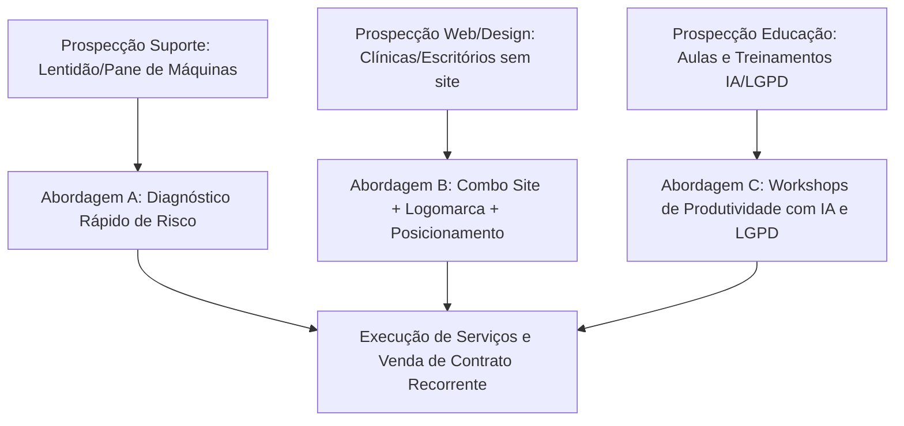

# Planejamento de Marketing - ServiDesk

Este documento detalha o planejamento estratégico e operacional de marketing para a **ServiDesk - TI e Suporte**, visando a venda de serviços de suporte técnico, backups, desenvolvimento de sites, design de logomarcas, aulas de informática e gestão de projetos sociais para profissionais liberais, consultórios, clínicas e pequenas empresas.

---

## 1. Posicionamento de Mercado
A ServiDesk atua como a **Retaguarda Tecnológica e Operacional Completa** de pequenos negócios e profissionais liberais, combinando a estabilidade de computadores, proteção de dados, identidade de marca e capacitação corporativa sob a coordenação de um especialista sênior.

*   **Público-alvo**: Clínicas médicas, consultórios odontológicos, escritórios de advocacia, contabilidade, pequenos negócios locais e profissionais liberais (médicos, advogados, psicólogos, terapeutas).
*   **Mensagem central**: "Seu negócio online e funcionando sem falhas. Cuidamos do seu suporte de TI, backup de dados, site institucional e identidade de marca."
*   **Assinatura oficial**: "ServiDesk - TI e Suporte"
*   **Contato Oficial**: +55 21 98386-0526
*   **Diferenciais de Autoridade (Credenciais do Arthur Camargo & Clientes ServiDesk)**:
    *   **25+ Anos de Experiência**: Atuação em informática e suporte sênior desde 2000.
    *   **Portfólio de Clientes de Relevância**:
        *   *Órgãos & Instituições*: Fundação Trompowsky (Exército Brasileiro - sob coordenação do Cel. Antônio Guelfi), CDI (Comitê para Democratização da Informática), CBPF (Centro Brasileiro de Pesquisas Físicas - com o Prof. Dr. Ramiro de Porto Alegre Muniz), AAPBB (Associação de Aposentados e Pensionistas).
        *   *Empresas & Franquias*: Rio Water Planet, Mr. Coffee, DZ Negócios com Energia, Langsoft, Condomínio Leblon Center.
        *   *Escritórios & Serviços*: Comprove (Cooperativa de Serviços), Escritório Alberto Garcia, Maiza Santesso Contabilidade, Storino Contabilidade, Ricardo Machado Advocacia, RRConsultoria (Renato Redenschi).
    *   **Certificações Relevantes**: *AWS Cloud Fundamentals*, *Privacidade e Proteção de Dados (LGPD)*, *Técnico em Eletrônica*.
    *   **Pioneirismo em IA**: Formação especializada em Inteligência Artificial aplicada a negócios (Análise de Dados, OpenAI e Google).

---

## 2. Funil de Captação e Iscas Comerciais (Canais de Entrada)
Por contar com serviços versáteis de suporte, design e educação, o funil de captação é modular:

### Abordagem A: O Diagnóstico de Risco de TI (15 minutos)
Verificação gratuita de 3 pilares:
1.  **Redundância de Backup**: O que acontece se o HD da recepção falhar hoje? Há cópia física e em nuvem?
2.  **Segurança Básica**: Antivírus ativos e sistemas operacionais atualizados.
3.  **Lentidão Operacional**: Avaliação de gargalos de hardware em computadores de recepção.

### Abordagem B: O Combo de Posicionamento Digital (Design & Web)
Oferecer o desenvolvimento completo do site institucional, criação de logomarca oficial e posicionamento de marca (StoryBrand). Excelente para capturar clientes novos que estão abrindo consultórios ou escritórios.

### Abordagem C: Treinamentos de Produtividade com IA & Adequação LGPD
Uso das credenciais de Professor de Informática e especialista certificado para ministrar workshops in-company:
*   **Workshop IA para Negócios**: Ensinar secretárias e equipes administrativas a utilizarem IAs (ChatGPT/Gemini) para automatizar respostas, criar relatórios de agendamentos e turbinar a produção diária.
*   **Workshop LGPD Prático**: Como manusear prontuários, fichas de pacientes e contratos em conformidade com as regras de privacidade vigentes.

---

## 3. Scripts de Abordagem Outbound (WhatsApp/LinkedIn)

### Script 1: Abordagem Telefônica/WhatsApp (Foco em Treinamento em IA e Produtividade)
> "Olá, boa tarde. Por favor, quem é o responsável pela administração da clínica/escritório?
> *(Ao falar com o responsável)*
> Meu nome é Arthur, sou especialista em TI da ServiDesk. Nós prestamos suporte técnico e também ministramos **workshops de produtividade com Inteligência Artificial para equipes administrativas**.
> Nós treinamos sua equipe para utilizar ferramentas de IA (como ChatGPT e Google Gemini) para agilizar o atendimento, responder e-mails e organizar relatórios, além de fazermos a proteção básica de arquivos (LGPD).
> Nós temos uma janela para um workshop de demonstração gratuito de 20 minutos na próxima semana para mostrar como a IA pode economizar horas de trabalho da sua recepção. Qual seria o melhor dia para conversarmos?"

### Script 2: Abordagem LinkedIn (Uso de Credenciais e Autoridade)
> "Prezado [Nome],
> Acompanho sua atuação na área de [Área]. 
> Atuo com a ServiDesk prestando suporte técnico de TI e desenvolvendo websites de alta conversão. Nossa trajetória conta com serviços prestados a grandes marcas e instituições como a **Fundação Trompowsky (Exército Brasileiro)**, **CDI-RJ**, **Rio Water Planet**, **Mr. Coffee** e cooperativas profissionais como a **Comprove**, além de possuirmos certificação **AWS Cloud** e especialização em **IA para Negócios**.
> Se você planeja criar um site de alta conversão, desenhar sua logomarca ou precisa de uma retaguarda técnica de TI confiável (helpdesk e backups locais/nuvem) para seus computadores, estamos à disposição.
> Se desejar avaliar uma proposta, podemos agendar um breve contato por WhatsApp no +55 21 98386-0526."

---

## 4. Estrutura de Planos e Serviços da ServiDesk

| Categoria | Cobertura do Serviço | Indicado Para | Modelo de Preço sugerido |
|---|---|---|---|
| **Helpdesk & Suporte** | Manutenção corretiva/preventiva, formatação, instalação de programas, limpeza física de hardware e suporte remoto ilimitado. | Consultórios, escritórios e profissionais individuais. | Mensal recorrente (Ex: R$ 400 - R$ 700) ou Avulso por chamada técnica (R$ 150/h) |
| **Backup Físico & Nuvem** | Configuração de backups redundantes locais (HD externo/NAS) e automatizados em nuvem pública segura (AWS/OneDrive). | Clínicas e escritórios que guardam prontuários e contratos confidenciais. | Incluso nos planos de suporte ou avulso sob projeto. |
| **Sites, Logos & Posicionamento** | Criação de site institucional de alta performance, design de logomarcas oficiais e consultoria de posicionamento de marca. | Profissionais liberais e empresas iniciando ou se modernizando. | Sob orçamento (Ex: R$ 1.500 - R$ 3.000 por site/marca) |
| **Aulas & Treinamentos de IA** | Aulas particulares de informática (Windows, ferramentas básicas), **Workshops de IA para Negócios** (OpenAI/Google), adequação básica à **LGPD** e gestão de projetos sociais. | Pessoas físicas, secretárias, equipes corporativas e ONGs. | Hora-aula individual (Ex: R$ 80 - R$ 120/h) ou Workshops empresariais sob orçamento. |

---

## 5. Próximos Passos de Execução
1.  **Reforço de Marca**: Atualizar o portfólio apresentado aos clientes antigos destacando a capacitação em IA corporativa e backups automatizados.
2.  **Campanha de Workshops de IA**: Oferecer o Workshop IA demonstrativo para clínicas e escritórios na Zona Sul e Zona Norte como atração rápida de clientes de suporte.
3.  **Prospecção LinkedIn**: Implementar o Script 2 com foco em reforçar as credenciais de projetos anteriores de peso (Exército e CDI-RJ).
